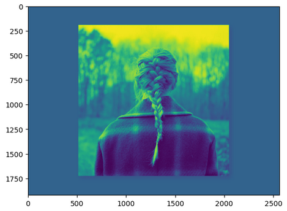
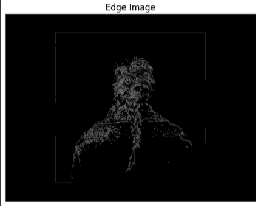
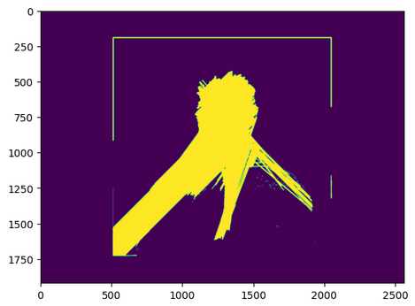

# Edge-Linking-using-Hough-Transform
## Aim:
To write a Python program to detect the lines using Hough Transform.

## Software Required:
Anaconda - Python 3.7

## Algorithm:
### Step1:
Import all the necessary modules for the program.

### Step2:
Load a image using imread() from cv2 module.

### Step3:
Convert the image to grayscale.

### Step4:
Using the Canny operator from cv2, detect the edges of the images.

### Step5:
Using the houghlinesP(), detect the line co-ordinates for every points in the images. Using for loop, draw the lines on the found co-ordinates.
Display the image.


## Program:

## Read image and convert it to grayscale image
```Python
## Developed by : Prasannalakshmi G
## Reg no : 2122240075

import cv2
import numpy as np
import matplotlib.pyplot as plt
image1=cv2.imread('cat.jpg',0)
img= cv2.GaussianBlur(image1,(3,3),0)
plt.imshow(img)
```

## Find the edges in the image using canny detector and display
```Python
## Developed by : Prasannalakshmi G
## Reg no : 2122240075

edges1 = cv2.Canny(img,100,200)
plt.imshow(edges1,cmap = 'gray')
plt.title('Edge Image'), plt.xticks([]), plt.yticks([])
plt.show()
```


## Detect points that form a line using HoughLinesP
```Python
## Developed by : Prasannalakshmi G
## Reg no : 2122240075

lines=cv2.HoughLinesP(edges1,1,np.pi/180, threshold=80, minLineLength=50,maxLineGap=250)
```

## Draw lines on the image
```Python
## Developed by : Prasannalakshmi G
## Reg no : 2122240075

for line in lines:
    x1, y1, x2, y2 = line [0] 
    cv2.line(edges1,(x1, y1),(x2, y2),(255,0,0),3)
```

## Display the result
```Python
## Developed by : Prasannalakshmi G
## Reg no : 2122240075

plt.imshow(edges1)

```
## Output :

### Input image :


### Grayscale image:



### Canny Edge detector output :




### Display the result of Hough transform :




## Result:
Thus the program is written with python and OpenCV to detect lines using Hough transform. 
